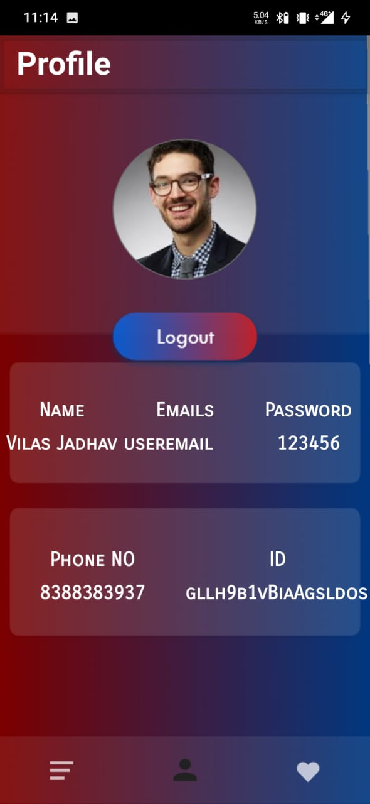
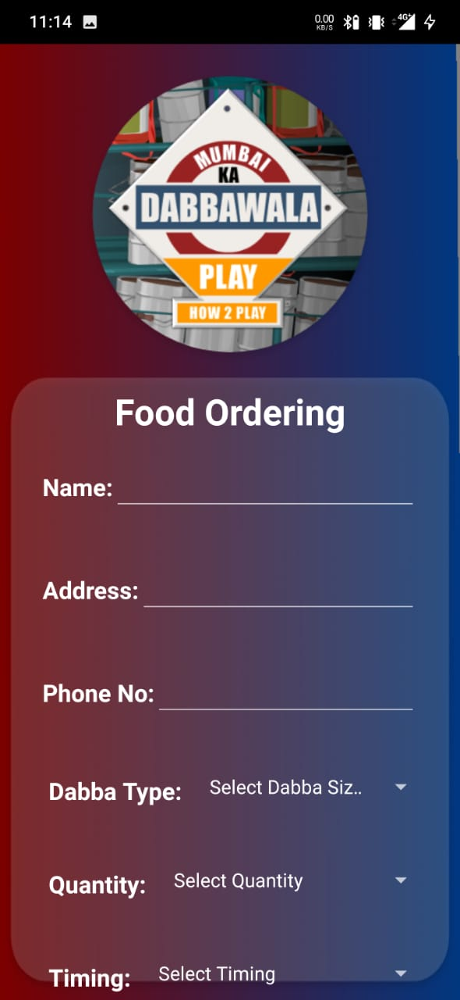

# Dabba Wala App

### ABSTRACT 
This Android application redefines Dabba service in Mumbai, offering a convenient platform for online ordering of fresh homemade lunch. The project's core objective is to gain firsthand experience and insights into the efficient supply and management of food delivery by the renowned Dabbawala team. Amidst the availability of readymade meals, the app brings the authentic taste of homemade food to the busy lives of Mumbaikars, making lunch preparation seamless. It not only caters to students seeking knowledge but also contributes to supporting and empowering Mumbai's dedicated Dabbawalas.

## Working ScreenShot

### Home Screen & Loading Screen

--------------

### Dabba Order Screen
--------------

## Built With 🎯
**A lot of love and a little Java**

## Contributing 

Make Pull requests which improve the functionality of the application in any sorts. It should conform with the following conditions. 
* Clear , short , crisp description of the PR. 
* Should add on to the value of the application.

## Acknowledgments 💖

* To my family👪  and friends 👫 who always kept me motivated.
* To the community of computer science 💻.

